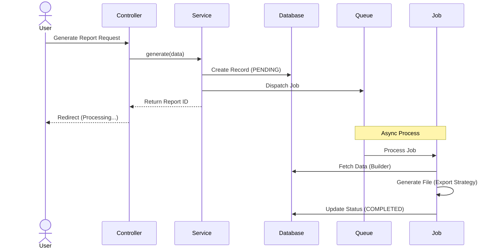

# Reporting Service Documentation Overview

This directory contains the complete logic for the Reporting System. It follows the **Builder Pattern** and **Strategy Pattern** to ensure flexibility and scalability.

## 🔄 Full Workflow (How it Works)

Here is the step-by-step journey of a report generation request:

### 1. The Request (Input)

-   **User Action**: The user fills out the form on the frontend (Report Type, Date Range, Filters, Format).
-   **Validation**: `App\Http\Requests\Reports\GenerateReportRequest` validates the input data to ensure it's correct.
-   **Controller**: `App\Http\Controllers\Reports\AnalyticsReportController` receives the validated request.

### 2. The Service (Orchestration)

-   The Controller calls `App\Services\Reporting\ReportService::generate()`.
-   **DTO Creation**: The service converts the raw request array into a structured `ReportFilterDTO` (Data Transfer Object).
-   **Record Creation**: A `GeneratedReport` record is created in the database with status `PENDING`.
-   **Job Dispatch**: The service dispatches a background job `GenerateReportExportJob` to handle the heavy lifting asynchronously.
-   **Response**: The user is immediately redirected back with a "Processing" message and the `report_id`.

### 3. The Job (Async Processing)

-   **Job**: `App\Services\Reporting\Jobs\GenerateReportExportJob` picks up the task in the background.
-   **Factory**: It asks `ReportBuilderFactory` to give it the correct builder (e.g., `SalesBuilder`, `AnalyticsBuilder`) based on the `reportType`.
-   **Director**: The `ReportDirector` instructs the Builder to:
    1. Set the Date Range.
    2. Select Columns.
    3. Apply Filters.
-   **Result**: The Builder returns a `ReportDTO` containing the raw data from the database.

### 4. The Export (Output)

-   **Strategy**: The `ExportService` uses the `ExportStrategyFactory` to pick the right strategy (PDF, CSV, Excel) based on the requested `format`.
-   **File Generation**: The selected Strategy (e.g., `PdfExportStrategy`) takes the `ReportDTO`, formats the data, and saves the file to `storage/app/public`.
-   **Completion**: The Job updates the `GeneratedReport` record status to `COMPLETED` and saves the file path.

### 5. Auto-Download (Frontend)

-   The frontend polls the server to check the status of the `report_id`.
-   Once the status is `COMPLETED`, the browser automatically triggers the download via the `download()` method in the Controller.

---

## 📂 Directory Structure

-   **Builders**: Contains the logic for querying data for specific report types.
    -   `AnalyticsReportBuilder.php`
    -   `SalesReportBuilder.php`
-   **Contracts**: Interfaces that define the rules for Builders and Exporters.
-   **Director**: Orchestrates the building process (Director in Builder Pattern).
-   **DTOs**: Data Transfer Objects.
    -   `ReportFilterDTO.php`: Input parameters (Filters, Dates).
    -   `ReportDTO.php`: Output data (Collection of results).
-   **Enums**: Fixed values like `ReportStatus` (Pending, Processing, Completed).
-   **Exports**: Logic for generating files.
    -   `Strategies/`: PDF, CSV, Excel implementations.
-   **Factories**: Creates instances of Builders and Export Strategies.
-   **Jobs**: Background jobs for async processing (`GenerateReportExportJob`).
-   **Providers**: Registers the service in the Laravel container.

## 📊 Sequence Diagram

## ⏳ Job Execution Timeline

1.  **Job Received**: The queue worker picks up the `GenerateReportExportJob`.
2.  **Builder Resolved**: The `ReportBuilderFactory` creates the correct builder instance.
3.  **Data Fetched**: The Builder queries the database using the provided filters.
4.  **Export Strategy Selected**: The `ExportService` picks the correct format strategy (PDF/CSV).
5.  **File Generated**: The file is created and saved to storage.
6.  **Report Marked Completed**: The database record is updated with the file path and status.

## 🛡️ Error Handling

-   **Empty Data**: If the query returns no results, an empty report is generated (or a specific message is returned).
-   **Job Failure**: If an exception occurs during processing, the `GeneratedReport` status is updated to `FAILED`.
-   **Export Failure**: If the file cannot be written, the job fails and can be retried (default Laravel retry logic applies).

## 🚀 Performance Notes

-   **Queue Processing**: All PDF and heavy export generation happens on the Queue to prevent blocking the main thread.
-   **Select Specific Columns**: Builders only fetch the requested columns to reduce memory usage.
-   **Efficient Querying**: For large datasets, use `cursor()` or `chunk()` instead of `get()` to keep memory footprint low.
